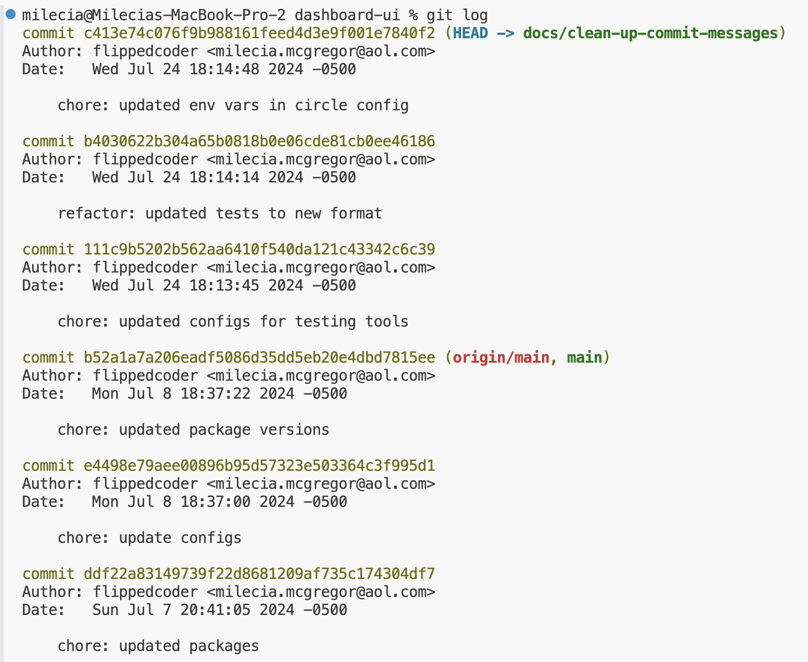
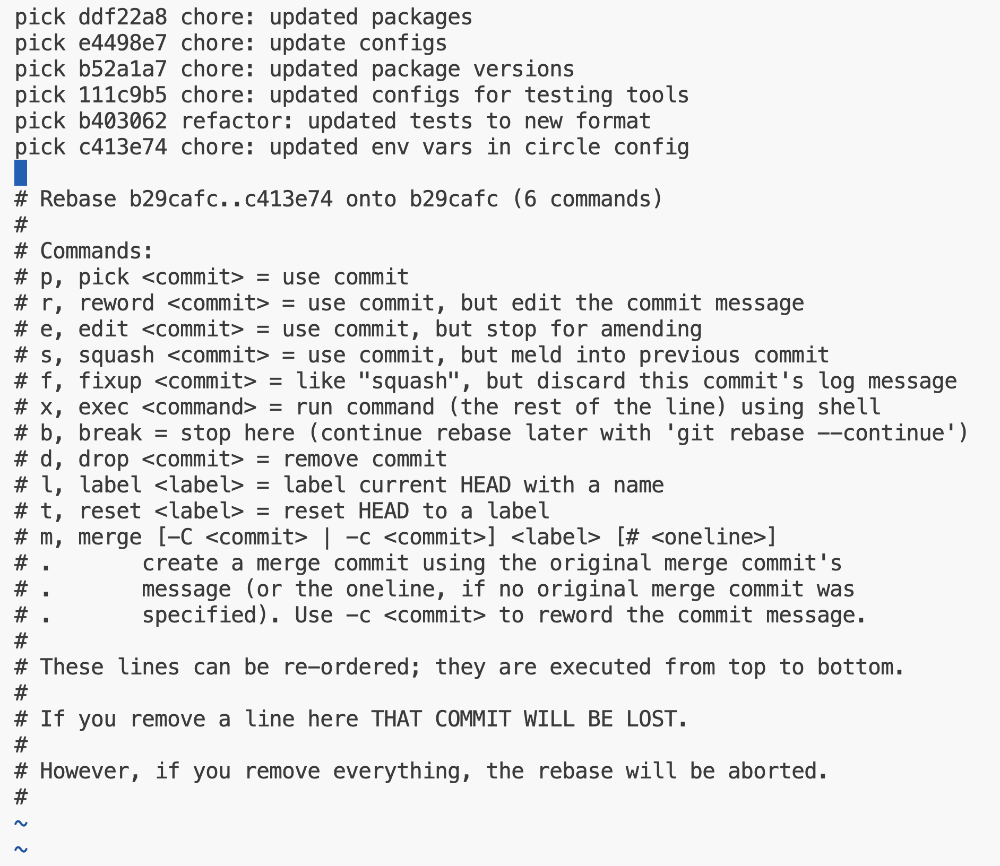
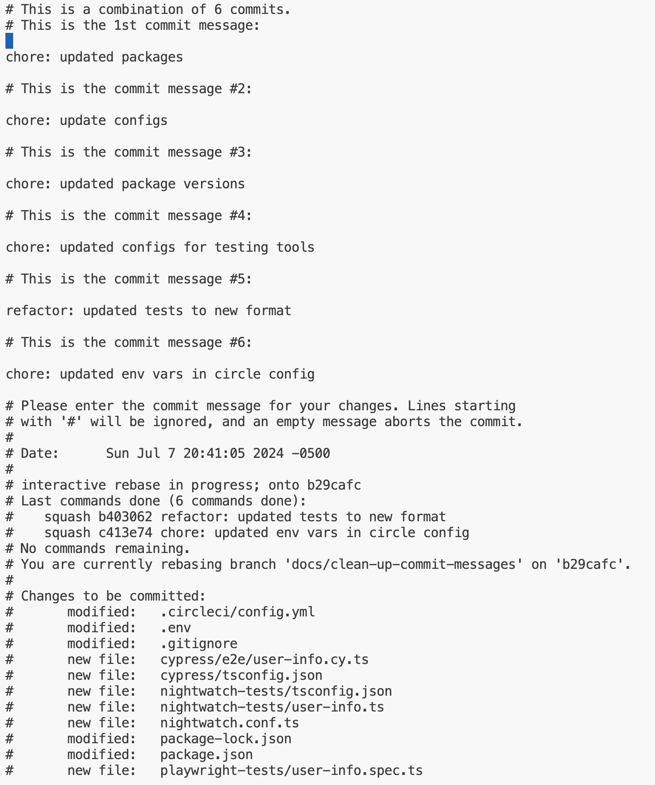
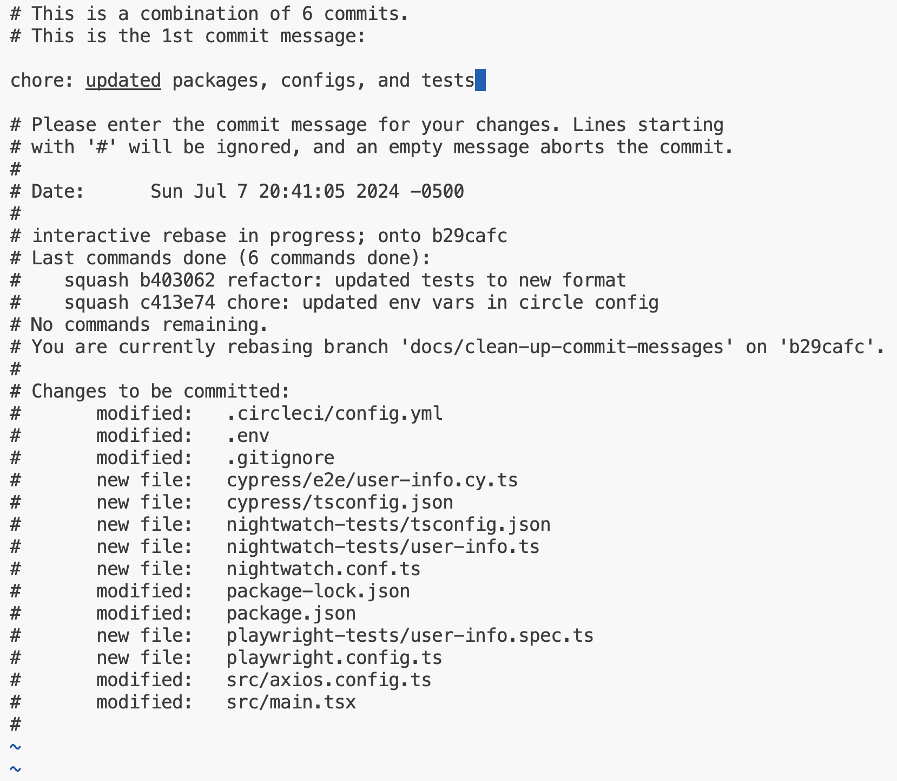
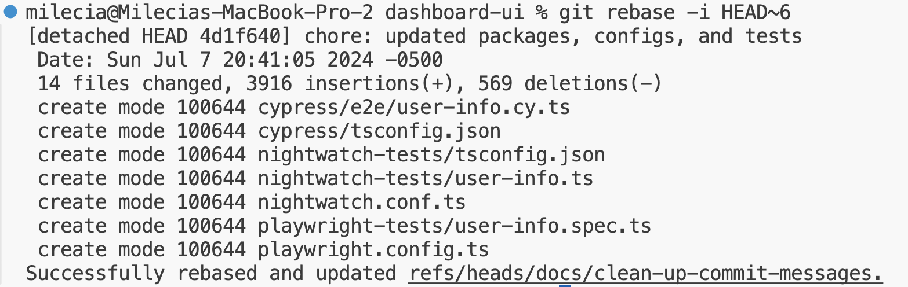
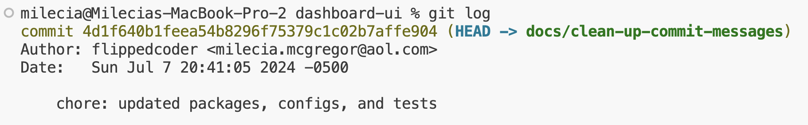

# How `git rebase` works

You should take some time to look through the current Git history at your organization. You can do this in the terminal with `git log`. Or you can look at it directly in GitHub. You’ll see the timestamps, the author, and the commit message along with the commit hash. This hash is useful if you need to review specific changes or if you have modifications to make.

The Git history is a great source of information when you’re debugging across all of the environments. It’s useful to periodically take a look at the Git history to see what has been happening with other features because you won’t single-handedly keep up with every change. You can even see when the merge rules have been broken and investigate if it was related to a hotfix or not. It’s also a good way to see when changes need to be pushed to other branches or need to be pulled down locally.

Here’s an example output from the git log command.



To squash these commits locally, you’ll use the interactive git rebase -i HEAD~n command in the terminal. The n is the number of recent commits you want to include in the squash, starting from the head of the branch. In this example, you have six commits we want to squash into one so the command you’ll use is git rebase -i HEAD~6. You’ll see an interactive menu similar to this in your terminal.



You want to focus on the top six lines that have the pick keyword next to them because these are the commits you’re squashing. To combine everything into one commit you have to make a few updates in this menu to squash all of the commits into the first one. If you forget, there will be an error message to help guide you on that. Here’s what those updates will be.

```
pick ddf22a8 chore: updated packages
squash e4498e7 chore: update configs
squash b52a1a7 chore: updated package versions
squash 111c9b5 chore: updated configs for testing tools
squash b403062 refactor: updated tests to new format
squash c413e74 chore: updated env vars in circle config
```

You type this in that interactive menu. If it’s not letting you type anything, just hit the i key in the terminal and then you should be able to make these edits. Once you’re done with the edits, then you can hit the escape key, type :wq in the terminal, and hit enter. That will take you to a confirmation screen where you can review all of the commits that will be squashed.



Once you have checked that you have all of the commits included that you want to squash, you need to update the commit message. You interact with the menu the same way as when you changed the pick keywords to squash. I usually delete all of the commit messages and make one that encompasses the changes like in the example below.



After you have a descriptive commit message for all of the smaller commits you’ve squashed you can hit the escape key, type :wq in the terminal, and hit enter again. Then you should get a success message similar to this.



If you check the history now, you’ll see one commit message instead of the initial six messages.


